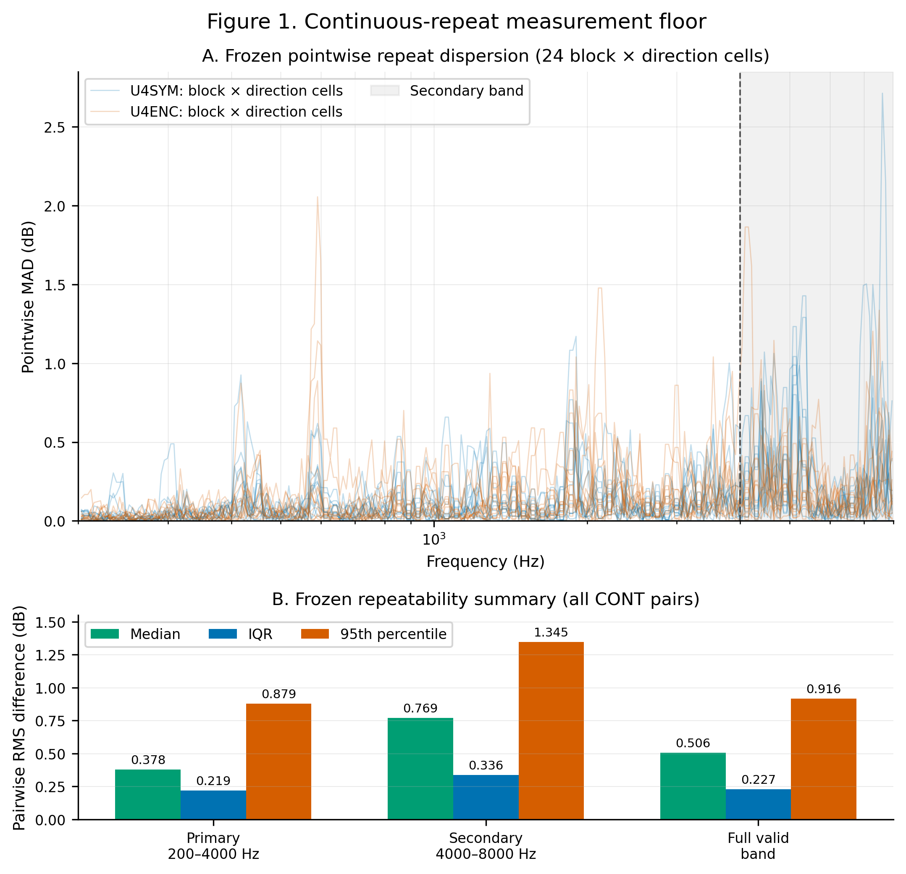
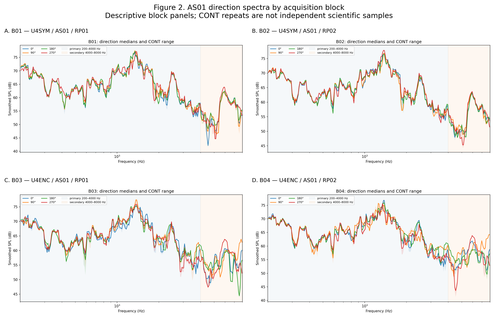
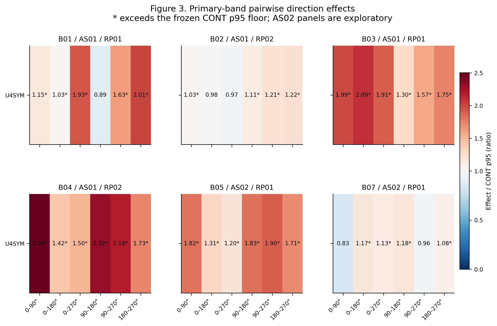
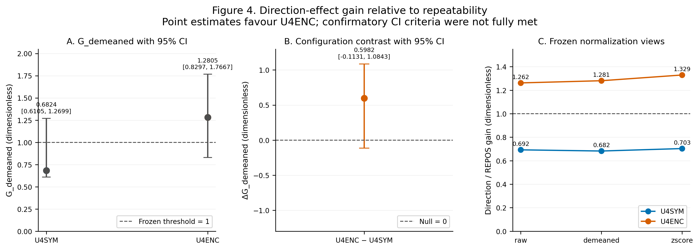
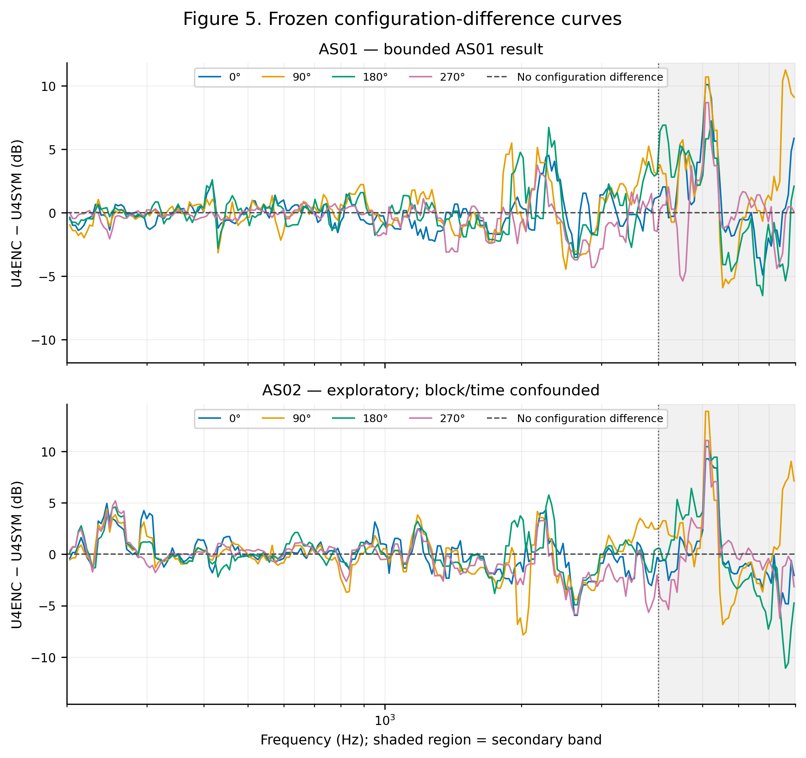
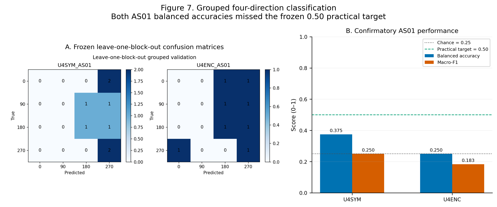
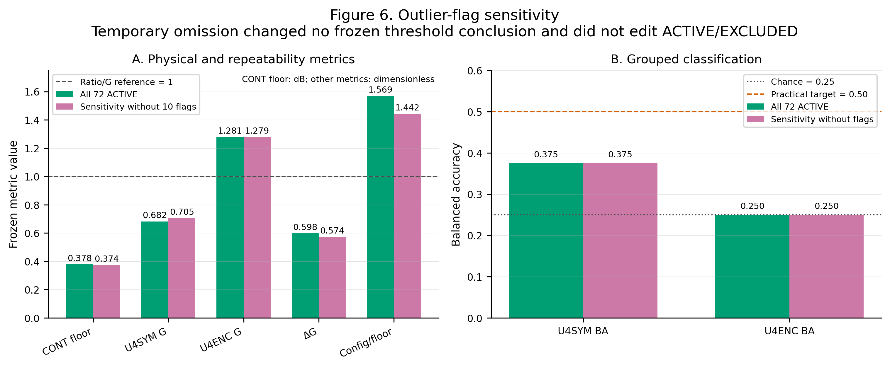

# Experimental Chapters — Final Integrated Draft

## Document authority and claim state

This chapter integrates the frozen FORMAL-3, FORMAL-4 and FORMAL-5 evidence and the WRITE-1 to WRITE-3 drafts. It does not recalculate statistics, alter sample selection, or regenerate figures.

The frozen disposition is `supported_with_limits`. The hypothesis decisions remain `H0=not_rejected` and `H1=not_confirmed`.

The evidence state remains `scientifically_eligible=false` and `final_test_read=false`; final-test remained sealed throughout this integration.

## 1. Methods

### 1.1 Research design and question

The study compared a symmetric internal structure, U4SYM, with an encoded asymmetric structure, U4ENC. It asked whether U4ENC produced repeatable direction-related spectral features stronger than those of U4SYM.

Confirmatory directions were 0°, 90°, 180° and 270°. AS01 and AS02 denoted assembly sets. Continuous repeat (CONT), repositioning repeat (REPOS) and reassembly repeat (REASM) described distinct error sources.

CONT curves were technical repeats and were not treated as independent scientific samples. Independence was represented mainly by acquisition blocks, sessions, REPOS states and REASM states.

### 1.2 Realised sample structure

The streamlined real-data archive contained 72 ACTIVE files and 19 EXCLUDED files. The frozen selection was preserved, and EXCLUDED files did not enter preprocessing, metrics, classification or conclusions.

Ten ACTIVE curves carried FORMAL-3 outlier flags. They remained in the primary analysis and were omitted only temporarily in a declared sensitivity view; the ACTIVE/EXCLUDED manifests were unchanged.

The realised blocks were B01 and B02 for U4SYM/AS01, B03 and B04 for U4ENC/AS01, B05 for U4ENC/AS02, and B07 for U4SYM/AS02.

Each block contained four directions and three CONT measurements per direction. AS01 had two blocks per configuration; AS02 had one block per configuration and therefore remained exploratory and confounded with block/time.

### 1.3 Equipment and measurement environment

Measurements used one iMM-6C microphone, a consumer loudspeaker chain and one ordinary room. The evidence does not establish an anechoic or semi-anechoic environment.

Room reflections and source–object geometry may contribute to the measured response. [CITATION NEEDED: C01 — ordinary-room reflections in acoustic response measurement]

The target loudspeaker-to-object-centre distance was about 0.8 m, but a completed geometry record was unavailable in the frozen evidence. No independent second room, source or microphone chain was used.

### 1.4 Calibration evidence and acquisition settings

The iMM-6C sensitivity file was `CMM29939.txt`. FORMAL-2A-FIX verified that REW showed the iMM-6C measurement input and this file in the microphone-calibration area.

That evidence supports input sensitivity correction. It does not establish traceable absolute sound-pressure level (SPL) calibration for the full playback, room and microphone chain.

The distinction between microphone correction and absolute system calibration must be retained. [CITATION NEEDED: C02 — measurement-microphone calibration and absolute SPL traceability]

Room EQ Wizard (REW) V5.31.3 used a 48 kHz sample rate, 256k Sweep length, one repetition, no timing reference and `t=0` at the impulse-response peak.

Capture covered 200–8000 Hz at -30 dBFS. Windows output volume was 50 and iMM-6C input volume was 100. Audio enhancements, automatic gain control, equalisation and spatial effects were disabled.

### 1.5 Provenance, selection and quality control

The immutable source ZIP SHA-256 was `cfbaa7a3c300b8443d934462386e9a5faad74d2b2cf0a50292d8c08423f7b4cb`. FORMAL-3 fixed every ACTIVE and EXCLUDED identity before analysis.

Each ACTIVE export was checked for REW parsing, finite values, strictly increasing frequency, 200–8000 Hz coverage, source metadata and hash integrity. Structural failures were fail-closed.

Ordinary curve outliers produced flags only. The analysis did not silently delete curves, convert warnings to passes, or use the 19 EXCLUDED files downstream.

### 1.6 Preprocessing

The formal Sweep path used a common logarithmic grid from 200 to 8000 Hz at 48 points per octave. Interpolation operated separately within continuous valid frequency segments.

The 200 Hz boundary point remained invalid because the measured support did not justify extrapolation. Invalid or missing gaps were neither crossed nor zero-filled.

After interpolation, 1/12-octave smoothing was applied in dB within each continuous valid segment. Fractional-octave smoothing and log-frequency sampling require methodological support.

[CITATION NEEDED: C03 — fractional-octave smoothing and logarithmic frequency sampling]

Each of the 72 formal FeatureSets had the same 255 valid common-grid points. The primary band was 200–4000 Hz; the secondary sensitivity band was 4000–8000 Hz.

### 1.7 Repeatability and directional metrics

Within each block×direction cell, the three CONT curves produced pairwise root-mean-square (RMS) dB differences, median absolute difference, 95th-percentile absolute difference and pointwise dispersion.

The primary-band CONT distribution defined the technical repeatability floor. Its median, interquartile range (IQR) and 95th percentile were frozen before final synthesis.

For each block, direction effects were distances between robust direction-median spectra. `G_demeaned` was the median between-direction distance divided by the median within-direction REPOS distance after demeaning.

`G_raw`, `G_demeaned` and `G_zscore` retained distinct scale interpretations. A ratio above one indicated a point estimate larger than its reference variability, not automatic confirmation.

### 1.8 Configuration, uncertainty and classification

AS01 configuration effects compared B01/B02 with B03/B04 while retaining block structure. AS02 compared B07 with B05 but remained exploratory because assembly, block and time could not be separated.

Confidence intervals (CIs) used block-aware resampling rather than treating CONT curves as independent. [CITATION NEEDED: C04 — cluster bootstrap for hierarchical repeated measurements]

Grouped four-direction classification left whole acquisition blocks out. Repeats from the same block×direction cell were never randomly divided between training and test data.

Balanced accuracy and macro-averaged F1 (macro-F1) were reported. Four-class chance was 0.25 and the frozen practical balanced-accuracy target was 0.50. [CITATION NEEDED: C05 — balanced accuracy and macro-F1 for multiclass evaluation]

### 1.9 Frozen decision rules

The primary rule required U4ENC `G_demeaned>1`, U4ENC above U4SYM and a positive delta whose CI excluded zero. Physical directional differences had priority over classification accuracy.

The analysis also required direction effects to remain after demeaning and z-scoring, to exceed repeat/assembly variation, and to meet the grouped-classification target before a strong directional-identification claim.

## 2. Results

### 2.1 Data boundary and integrity

All 72 ACTIVE curves entered the primary analysis, and all 19 EXCLUDED curves remained outside it. FORMAL-4 verified the 72 common 255-point FeatureSets and every referenced artifact hash.

The 10 outlier flags were preserved as metadata. No result below uses post hoc deletion to improve the frozen conclusion.

### 2.2 Continuous-repeat measurement floor

The primary-band repeatability floor had median 0.3783 dB, IQR 0.2191 dB and p95 0.8793 dB. The p95 value was the conservative engineering reference for direction and configuration effects.

*Figure 1 / 图1. Continuous-repeat measurement floor / 连续重复测量误差底线. The secondary band is sensitivity evidence.*

Table 1 supplies the frozen values in [Markdown](tables/table_01_repeatability_floor.md) and [CSV](tables/table_01_repeatability_floor.csv).

### 2.3 Direction-related spectral differences

Figure 2 retains block and REPOS identity while showing the four robust direction-median spectra for AS01.

*Figure 2 / 图2. AS01 direction spectra by acquisition block / AS01 各 block 的方向频谱.*

All 6/6 U4ENC direction pairs exceeded the CONT p95 floor in both AS01 REPOS blocks. For U4SYM, 3/6 pairs did so in both blocks.

*Figure 3 / 图3. Pairwise direction effects / 方向两两效应. Ratios above one exceed the CONT p95 floor but do not establish classification.*

The frozen U4ENC `G_demeaned` was 1.2805 with 95% CI 0.8297–1.7667. U4SYM was 0.6824 with 95% CI 0.6105–1.2699.

The delta was 0.5982 with 95% CI -0.1131–1.0843. Its point estimate favoured U4ENC, but the interval crossed zero and did not confirm an advantage.

*Figure 4 / 图4. Direction-effect gain and confidence intervals / 方向效应增益与置信区间. Confirmatory reference crossings remain visible.*

Table 2 provides the gain estimates in [Markdown](tables/table_02_direction_gain.md) and [CSV](tables/table_02_direction_gain.csv).

### 2.4 Configuration and assembly-set comparisons

The AS01 median configuration effect-to-floor ratio was 1.5688. Thus, U4ENC−U4SYM differences were measurable relative to CONT variation in the realised AS01 blocks.

*Figure 5 / 图5. Configuration-difference curves / 配置差值曲线. AS01 is bounded evidence; AS02 is exploratory.*

AS02 results cannot independently identify an assembly-set effect because each configuration had only one AS02 block. Assembly, acquisition block and time were confounded.

### 2.5 Grouped four-direction classification

AS01 grouped validation gave U4SYM balanced accuracy 0.375 and macro-F1 0.250. U4ENC gave balanced accuracy 0.250 and macro-F1 0.183.

Both balanced accuracies were below the frozen 0.50 practical target. The results do not support reliable four-direction classification.

*Figure 7 / 图7. Grouped four-direction classification / 四方向分组分类. Both AS01 results remained below 0.50.*

Table 3 records the folds, metrics and target in [Markdown](tables/table_03_grouped_classification.md) and [CSV](tables/table_03_grouped_classification.csv).

### 2.6 Outlier sensitivity

Temporarily omitting the 10 flagged ACTIVE curves in the sensitivity view did not change any frozen threshold decision. It also did not change the 72 ACTIVE/19 EXCLUDED selection.

*Figure 6 / 图6. Outlier-flag sensitivity / Outlier flag 敏感性. Temporary omission changed no frozen conclusion.*

Table 4 provides the paired comparison in [Markdown](tables/table_04_outlier_sensitivity.md) and [CSV](tables/table_04_outlier_sensitivity.csv).

### 2.7 Frozen result state

The measurements detected direction-related spectral changes above the technical-repeat floor. U4ENC had the larger directional point estimate, but its lower CI crossed one and the delta CI crossed zero.

Accordingly, the final disposition was `supported_with_limits`, with `H0=not_rejected` and `H1=not_confirmed`.

## 3. Discussion

### 3.1 Direction effects relative to repeatability

The CONT floor separates observable spectral structure from ordinary technical repeat variation. Figures 1–3 show that several direction contrasts, especially for U4ENC, exceeded this floor across AS01 blocks.

This supports a bounded measurement claim: changing orientation produced repeatable frequency-response differences in the realised room–object system.

It does not isolate the internal structure from room interaction or establish generalisation beyond the measured setting. [CITATION NEEDED: C06 — room–object interaction in directional responses]

### 3.2 Why the hypotheses remain unresolved

The U4ENC point estimate exceeded the U4SYM point estimate, but uncertainty is decisive. The U4ENC CI crossed one, the U4SYM CI did not establish a full gate, and the delta CI crossed zero.

Thus, descriptive directional effects, `H0=not_rejected` and `H1=not_confirmed` can coexist without contradiction.

Interpreting an interval that crosses a frozen boundary requires a bounded claim rather than a binary positive result. [CITATION NEEDED: C07 — confidence intervals and bounded scientific claims]

### 3.3 Configuration and assembly interpretation

The AS01 ratio of 1.5688 indicates a measurable configuration contrast relative to CONT variability. It supports reporting a configuration-associated response difference within this realised design.

AS01/AS02 comparisons remain exploratory because block, time and assembly set are aliased. Independent assembly effects require a design that separates these factors. [CITATION NEEDED: C08 — design of repeated-measure assembly experiments]

### 3.4 Classification as a negative practical result

Figure 7 and Table 3 show that neither configuration reached the 0.50 balanced-accuracy target. Pairwise spectral separation therefore did not translate into stable four-class prediction.

Grouped validation was necessary because CONT curves shared physical states. Random repeat-level splitting could leak block-specific information. [CITATION NEEDED: C09 — grouped cross-validation for repeated measurements]

Classification is reported as a useful negative result. It does not erase the measured spectral changes, but it limits any claim that direction can be decoded reliably from this evidence.

### 3.5 Engineering meaning

The study shows that passive morphology can alter measured directional spectra above a technical-repeat floor in an ordinary-room setup. The strongest bounded evidence is physical response variation, not classification.

The larger U4ENC point estimate motivates further controlled replication, but it is not proof of superiority. [CITATION NEEDED: C10 — passive acoustic morphology for spatial encoding]

## 4. Limitations and Future Work

### 4.1 Room, source and calibration limits

Ordinary-room reflections, standing waves and environmental noise may shape both repeatability and direction effects. [CITATION NEEDED: C11 — room reflections, standing waves, and spatial response variability]

The source chain was consumer-grade and only one microphone and room were used. The verified sensitivity file does not provide absolute SPL calibration of the full system.

Future work should record geometry, source-monitor levels and calibration state for every block. [CITATION NEEDED: C12 — uncertainty in consumer audio measurement chains]

### 4.2 Sample independence and coverage

Three CONT curves per cell quantified technical repeatability but did not create three independent scientific observations. The number of independent blocks and assembly states was limited.

The study covered four orthogonal directions. Additional directions could be exploratory, but they must not replace independent block, REPOS and REASM replication.

### 4.3 Confounding and flagged curves

AS02 had one block per configuration, so assembly-set, block and time effects were inseparable. The AS02 comparison is therefore exploratory, not causal.

The 10 outlier flags were not deleted after inspection. Their sensitivity analysis was useful, but independent replication is preferable to post hoc omission.

### 4.4 Classification and scientific eligibility

Grouped classification was below the practical target. Future classification requires more held-out blocks, preregistered features and group-preserving validation.

[CITATION NEEDED: C13 — sample-size requirements for grouped multiclass validation]

`scientifically_eligible=false` records that the full preregistered confirmation and final-test requirements were not met. It does not mean the software failed or that the bounded measurements are unusable.

The final-test remained sealed and `final_test_read=false`. No final-test evidence, deployment authority or confirmatory scientific status was inferred.

### 4.5 Future work

Priority should go to independent AS01/AS02 blocks, more REPOS and REASM states, stronger geometry records, a more traceable level chain and a second measurement environment.

Any future predictive analysis should freeze features and thresholds before evaluation, retain block-aware validation, and keep final-test data inaccessible until its declared gate is met.

## 5. Final claim boundary

The chapter may state that direction-related frequency-response changes exceeded the CONT repeatability floor and that U4ENC had the higher directional point estimate.

It may state that AS01 showed a measurable configuration difference and that four-direction classification did not reach the frozen practical target.

It may not claim confirmation of H1, superiority of U4ENC, reliable four-direction classification, or a causal interpretation of AS01/AS02 differences.

It may not claim absolute SPL traceability, an anechoic environment, scientific eligibility, final-test use, freeze authority or deployment readiness.
